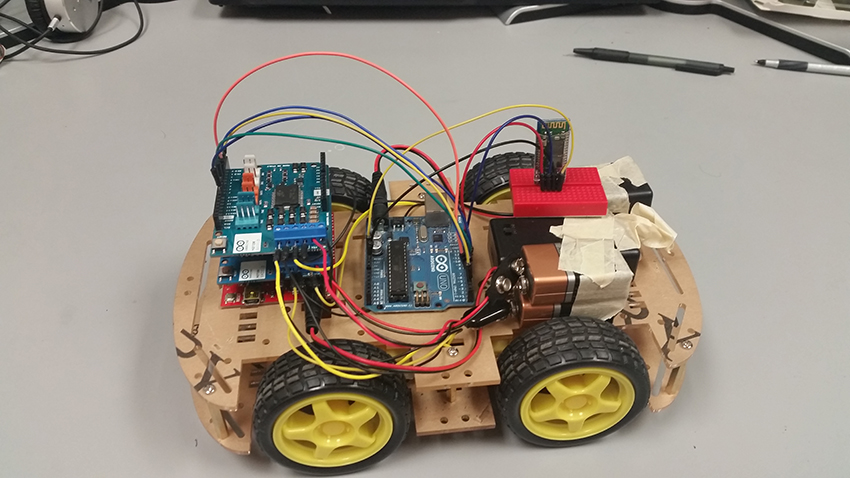

Ar2D2: An Android remote controlled Arduino car
=========
Our CS 362 Project by Oliver H and Brook H
 

used with the Android RC app downloaded from the Google Play Store

###Components

* 2 Arduino Uno board  
* 1 Arduino Wireless Bluetooth Transceiver
* 1 Raspberry Pi 2 board
* 1 Raspberry Pi Camera
* 1 2WD Motor Robot Car Chassis
* 1 4WD Motor Robot Car Chassis
* 2 Motor Drive Shield for Arduino
* 1 Mini Breadboard
* 2 Battery Case
* 4 9V Batteries
* 8 AAA Batteries
* Android Smartphone with AndroidRC installed
* 1 White Poster board
* Clear Tape
* Markers

###Step 1

Started with basic Arduino and Bluetooth communication

###Step 2

Added motors and two wheels from a 2 wheel car kit

###Step 3

Switched to a 4 wheel car kit

###Step 4

Preparation for wrapping the skin around car

###Step 5

Printed out R2D2 skin on top of a poster board and drew lines

 

###Video gif of controlling the Arduino car

